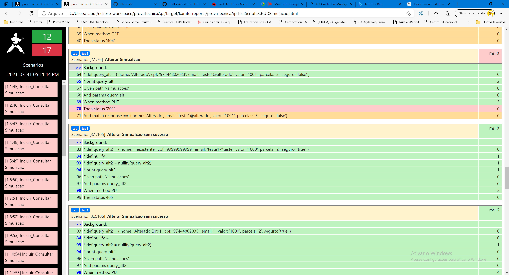

**API Test Automation with JAVA and Karate framework**

How to execute:

- Simply run TestRunner.java file as Junit test

Reports:

Reports are available at path: <yourworkspace>/target/karate-reports/karate-summary.html

Evidences:

